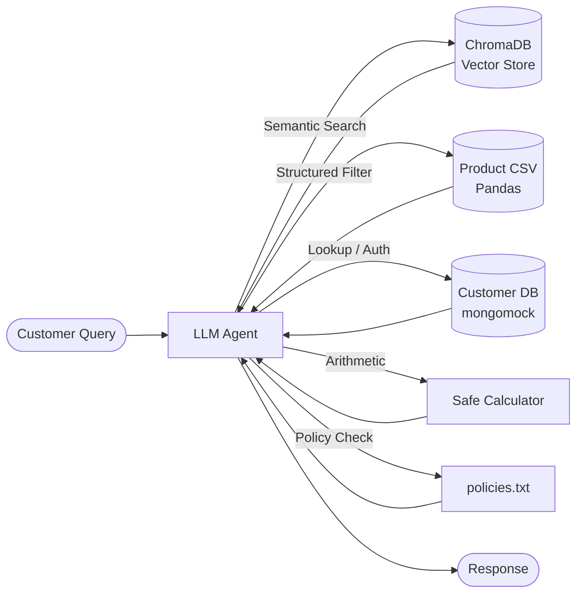

# AI Customer Support Agent

[](https://www.python.org/)
[](https://platform.openai.com/)
[](https://www.trychroma.com/)

An autonomous AI customer service agent that combines **Retrieval-Augmented Generation (RAG)** with **LLM tool calling** to handle product inquiries, customer authentication, and policy-aware responses.

## Architecture



**ReAct Loop**: The agent uses OpenAI function calling in a loop (capped at 15 iterations). It reasons about which tool to use, executes it, observes the result, and repeats until it has a final answer.

## Features

- **Semantic Product Search** — ChromaDB + `all-MiniLM-L6-v2` embeddings for natural language queries
- **Structured Filtering** — Pandas-based filtering by price, brand, category, availability, and on-sale status (`Sale Price < List Price`)
- **Privacy-Safe Customer Lookup** — `gift_lookup` mode returns only non-sensitive fields (name + interests), structurally preventing status/email leakage to third parties
- **Customer Authentication** — Email/password verification required before exposing any private account data
- **Policy Enforcement** — Premier discounts (5%), $2,000 premier threshold with calculator-verified math, max-3 suggestion limit, exact no-match response line
- **Premier Discount + Budget Check** — Automatically applies 5% discount for premier customers before concluding "no match" on budget-limited queries
- **Safe Calculator** — AST-based math evaluation (no `eval()`); handles oz→mL conversion and duration estimates with explicit formula output
- **Error Recovery** — Content filter errors are caught and fed back to the LLM to self-correct; empty API responses trigger a graceful nudge rather than a crash

## Project Structure

| File | Description |
|------|-------------|
| `agent.py` | Core agent — tool definitions, OpenAI loop, system prompt |
| `customer_store.py` | Loads customer data into in-memory MongoDB (mongomock) |
| `fetch_product_data.py` | Downloads & curates 787 products from Kaggle's Walmart dataset |
| `prepare_dataset.py` | Validates all required files are present and correct |
| `test_agent.py` | 10 sample queries exercising all agent capabilities |
| `prompts.md` | System prompt documentation and design notes |
| `policies.txt` | 7 company policies the agent must enforce |
| `customers.json` | 50 synthetic customer records |
| `example_queries.txt` | Sample queries for reference |

## Setup

### 1. Install dependencies

```bash
pip install -r requirements.txt
```

### 2. Generate product data

Downloads the Walmart product dataset from Kaggle (no account required):

```bash
python fetch_product_data.py
```

### 3. Verify setup

```bash
python prepare_dataset.py
```

### 4. Configure environment

Copy the example env file and fill in your values:

```bash
cp .env.example .env
# Edit .env with your API key and endpoint
```

Required variables (see [`.env.example`](.env.example)):
| Variable | Description |
|----------|-------------|
| `OPENAI_API_KEY` | Your OpenAI API key |
| `OPENAI_BASE_URL` | API endpoint URL |
| `OPENAI_MODEL` | Model name (default: `gpt-4.1-mini`) |

## Usage

```python
from agent import answer_question

response = answer_question("What scales do you have under $100?")
print(response)
```

Or run the full test suite:

```bash
python test_agent.py
```

## Key Design Decisions

| Decision | Rationale |
|----------|-----------|
| **Dual search strategy** | Semantic search (RAG) for natural language + Pandas filter for hard constraints (price, brand). Combined for queries with both types. |
| **`list_price` in ChromaDB metadata** | Enables on-sale detection (`Sale Price < List Price`) directly in vector search results — no LLM deduction needed. |
| **`gift_lookup` mode in `get_customer`** | Structurally limits returned fields to `{name, interests}` when looking up a friend's data, making it impossible to leak `status` or `email` to a third party. |
| **Interests-based diversity algorithm** | System prompt instructs agent to run one `search_products` per interest category and pick exactly 1 product per category (max 3 total), preventing category imbalance. |
| **Calculator-first arithmetic** | All math — including `oz → mL` conversion and duration estimates — is offloaded to a safe AST evaluator with explicit formula output. |
| **Premier discount before "no match"** | For premier customers with a price limit, the agent applies the 5% discount before concluding no product fits, matching the expected policy behavior. |
| **Safe arithmetic** | Whitelist-based AST evaluator handles all math — the LLM never does calculations "in its head". |
| **Lazy initialization** | ChromaDB index is built on first call and persisted, avoiding re-embedding on subsequent runs. |
| **mongomock** | Customer data uses an in-memory MongoDB mock — same pymongo API, zero infrastructure. |

## Technologies

- **Python 3.10+**
- **OpenAI API** — GPT-4.1 Mini with function calling
- **ChromaDB** — Vector similarity search
- **Sentence Transformers** — `all-MiniLM-L6-v2` embeddings
- **mongomock** — In-memory MongoDB
- **Pandas** — Structured data filtering

> **Note**: All customer data in this project is entirely fictional and generated for demonstration purposes.
